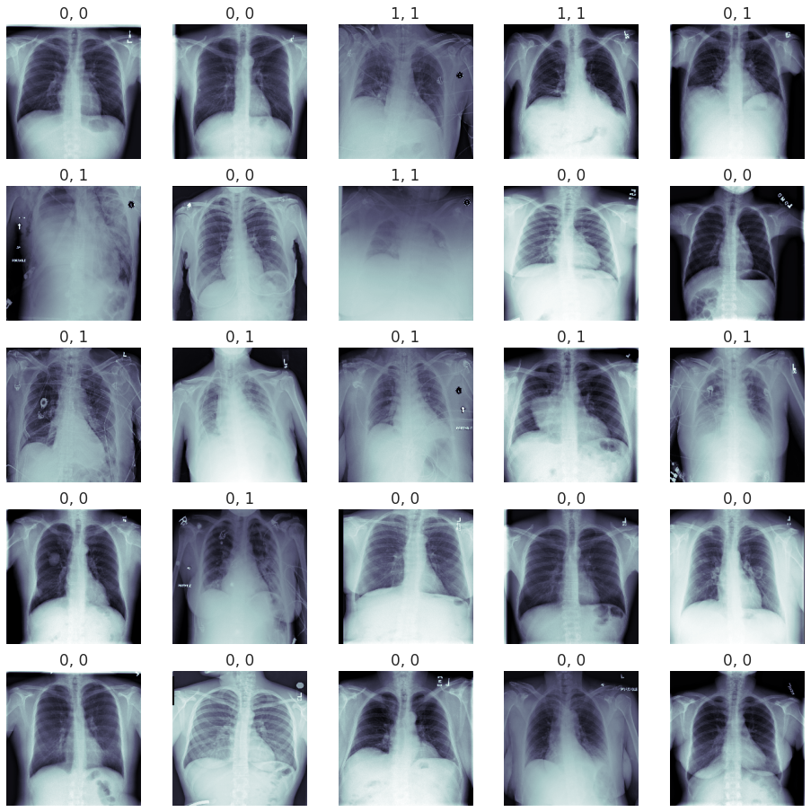
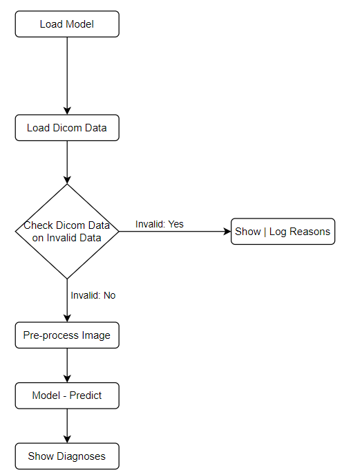
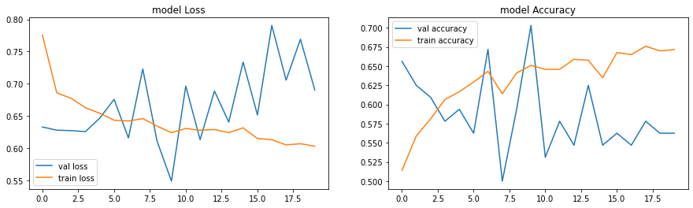
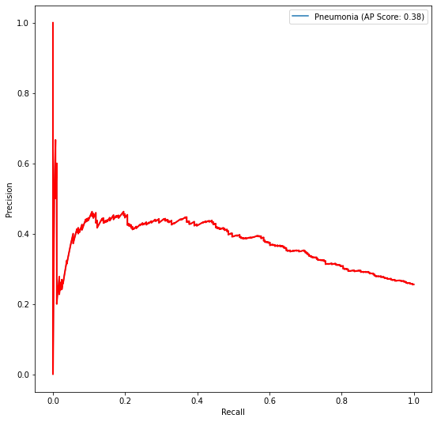

# Pneumonia Detection From Chest X-Rays

## Project Overview  
The aim of this project was to see if you can classify X-ray images into the respective classes: pneumonia and non-pneumonia.  

## Why?   
Chest X-ray exams are one of the most frequent and cost-effective types of medical imaging examinations. Deriving clinical diagnoses from chest X-rays can be challenging, however, even by skilled radiologists.

When it comes to pneumonia, chest X-rays are the best available method for diagnosis. More than 1 million adults are hospitalized with pneumonia and around 50,000 die from the disease every year in the US alone. The high prevalence of pneumonia makes it a good candidate for the development of a deep learning application for two reasons:  
1) Data availability in a high enough quantity for training deep learning models for image classification  
2) Opportunity for clinical aid by providing higher accuracy image reads of a difficult-to-diagnose disease and/or reduce clinical burnout by performing automated reads of very common scans.

The diagnosis of pneumonia from chest X-rays is difficult for several reasons:
- The appearance of pneumonia in a chest X-ray can be very vague depending on the stage of the infection
 - Pneumonia often overlaps with other diagnoses  
 - Pneumonia can mimic benign abnormalities
 


If you're curious how I approached this project, then you can see all the steps in detail through the following notebooks:  
(The best way to view these notebooks is via your webbrowser & nbviewer)
 1) https://nbviewer.jupyter.org/github/verbeemen/Udacity-AI-for-Healthcare/blob/main/Pneumonia_Detection_From_Chest_X-Rays/EDA.ipynb
 2) https://nbviewer.jupyter.org/github/verbeemen/Udacity-AI-for-Healthcare/blob/main/Pneumonia_Detection_From_Chest_X-Rays/Build%20and%20train%20model.ipynb
 3) https://nbviewer.jupyter.org/github/verbeemen/Udacity-AI-for-Healthcare/blob/main/Pneumonia_Detection_From_Chest_X-Rays/Inference.ipynb
 4) https://nbviewer.jupyter.org/github/verbeemen/Udacity-AI-for-Healthcare/blob/main/Pneumonia_Detection_From_Chest_X-Rays/FDA_Submission.ipynb

<br/>
<br/>

<br/>
<br/>

----------------------------------------------------------------------------------

# FDA  Submission

**Your Name:** Dieter Verbeemen

**Name of your Device:** The Chest X-Rays Pneumonia Notifier

## Algorithm Description

### 1. General Information

**Intended Use Statement:**
Notify (help) radiologist detect pneumonia

**Indications for Use:**
- The image must be a X-ray
- The X-ray image must be a DICOM file
- The X-ray image must be taken from the chest
- The X-ray image must be taken in the AP or PA position
- The patient, man or women should be between 1 and 90 years old


**Device Limitations:**
- Any modern computer with a standard CPU, although a GPU is advised

**Clinical Impact of Performance:**
- The best use for this model is to prioritize the worklist.
- The model has a low precision and a higher recall.
  - (Recall) This means if we have 100 patients with pneumonia,  
Then we can properly classify these 100 patients as a positive event.  
(without classifying them too much as _no pneumonia_).
  - Unfortunately, the precision is not very high. This means that  
we will also classify healthy patients as pneumonia.
 - However, if we want to prioritize our worklist then we should prioritize our ill patients above  
   the healthy patients (recall). But it isn't harmful to classify a healthy person with pneumonia.

### 2. Algorithm Design and Function



**DICOM Checking Steps:**
- Modality must be "DX"
- Body part examined must be "CHEST"
- Patient Position must be "PA" or "AP"

**Preprocessing Steps:**
- Image is normalized between 0 and 1
- Image is reshaped to a 224 x 224 image
- Image is repeated across 3 channels

**CNN Architecture:**

```python
Model: "sequential"
_________________________________________________________________
Layer (type)                 Output Shape              Param #   
=================================================================
model (Model)                (None, 7, 7, 512)         14714688  
_________________________________________________________________
flatten (Flatten)            (None, 25088)             0         
_________________________________________________________________
dropout (Dropout)            (None, 25088)             0         
_________________________________________________________________
dense (Dense)                (None, 1024)              25691136  
_________________________________________________________________
dropout_1 (Dropout)          (None, 1024)              0         
_________________________________________________________________
dense_1 (Dense)              (None, 512)               524800    
_________________________________________________________________
dropout_2 (Dropout)          (None, 512)               0         
_________________________________________________________________
dense_2 (Dense)              (None, 256)               131328    
_________________________________________________________________
dropout_3 (Dropout)          (None, 256)               0         
_________________________________________________________________
dense_3 (Dense)              (None, 1)                 257       
=================================================================
Total params: 41,062,209
Trainable params: 28,707,329
Non-trainable params: 12,354,880
_________________________________________________________________
```

*Model info:*
- The model contains out of 2 parts:
 - Part 1) A pre-trained [VGG16 model](https://keras.io/api/applications/vgg/):
    - A 16 layer pre-trained convolutional neural network based on imagenet.  
      The weights are not trainable.
 - Part 2) Four dense layers, each with its own dropout layer

### 3. Algorithm Training

**Parameters:**
* Types of augmentation used during training  
    - Rescale: pixel_value / 255
    - Horizontal flips: True,
    - Vertical flip: False,
    - Height shift range: 0.1,
    - Width shift range: 0.1,
    - Rotation range: 20,
    - Shear range: 0.1,
    - Zoom range: 0.1
    
    
-  Batch size: 64   
- Optimizer: Adam    
- Optimizer learning rate: 0.0003    
- Layers of pre-existing architecture that were frozen: First 16 layers of a VGG model  
- Layers of pre-existing architecture that were fine-tuned: None  
- Layers added to pre-existing architecture: Flatten, Dense and Dropout layers  






**Final Threshold and Explanation:**

* Threshold: 0.37415
* F1 Score: 0.46824

The final threshold of 0.37415 was based on the highest F1-Score of 0.46824.
Based on [this paper: CheXNet: Radiologist-Level Pneumonia Detection on Chest X-Rays with Deep Learning](https://arxiv.org/pdf/1711.05225.pdf),   
the average radiologist had a F1 Score of 0.387. This means that our model achieved a better F-1 score than the average radiologist. _(Please note that we have no information about who these radiologists were and whether they are representative of all radiologists..)_


### 4. Databases
* Dataset: [NIH Chest X-ray Dataset](https://www.kaggle.com/nih-chest-xrays/data)
* Amount of Chest, X-ray images: 112.120
* Meta data:
 * Image Index
 * Finding Labels
 * Follow-up 
 * Patient ID
 * Patient Age
 * Patient Gender
 * View Position
 * Original Image Size
 * Original Image Pixel Spacing  
 
   
* Amount of images with Pneumonia: 1431 (1.28%)  
* Amount of images without Pneumonia: 110689 (98.72%)


**Description of Training Dataset:**  
1145 images (80%) which contained Pneumonia will be used in the training dataset.
* Amount of Chest, X-ray images: 2290
 * Images containing pneumonia: 1145 (50%)
 * Images without pneumonia: 1145 (50%)

**Description of Validation Dataset:**
The remaining 286 images (20%) which contained Pneumonia will be used in the validation dataset.
 * Images containing pneumonia: 286 (25%)
 * Images without pneumonia: 858 (75%)

### 5. Ground Truth
* ChestX-ray dataset comprises 112,120 frontal-view X-ray images of 30,805 unique patients with the text-mined fourteen disease image labels (where each image can have multilabels)
* The disease labels were created using Natural Language Processing (NLP) to mine the associated radiological reports
* The labels are expected to be >90% accurate and suitable for weakly-supervised learning
* The data includes 14 common thoracic pathologies:
	* Atelectasis
	* Consolidation
	* Infiltration
	* Pneumothorax
	* Edema
	* Emphysema
	* Fibrosis
	* Effusion
	* Pneumonia
	* Pleural thickening
	* Cardiomegaly
	* Nodule
	* Mass
	* Hernia

_For more info: [https://www.kaggle.com/nih-chest-xrays/data](https://www.kaggle.com/nih-chest-xrays/data)_

### 6. FDA Validation Plan

**Patient Population Description for FDA Validation Dataset:**
- The patient can be men or women
- The recommended age is between 1 and 90 years old
- Chest X-Ray image must be taken in the AP or PA position
- Chest X-Ray image must be in DICOM format

**Ground Truth Acquisition Methodology:**
- Silver Standard: Validation by 4 different radiologists

**Algorithm Performance Standard:**
- The algorithm’s F1 score should be more than that of average radiologist (0.387)
